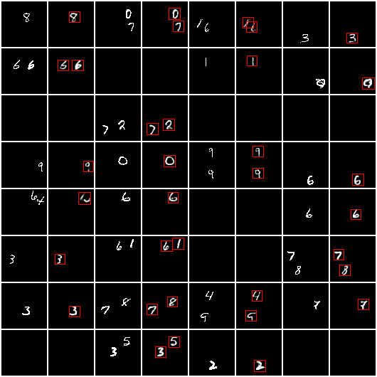

# Attend Infer Repeat

Attend Infer Repeat (AIR) [1] in PyTorch. Parts of this implementation are 
inspired by [this Pyro tutorial](https://pyro.ai/examples/air.html) [2] and 
[this blog post](http://akosiorek.github.io/ml/2017/09/03/implementing-air.html) [3].
See [below](#high-level-model-description) for a description of the model.

Install requirements and run:
```
pip install -r requirements.txt
CUDA_VISIBLE_DEVICES=0 python main.py
```

Results on the MNIST experiment from the paper are often (about 80% of the time)
reproduced with this implementation.
In the other cases, the model converges to a local maximum of the ELBO where the
recurrent attention often predicts more objects than the ground truth (either
using more objects to model one digit, or inferring blank objects). 


## Results

|  dataset             | likelihood                  | accuracy     | ELBO        | log _p(x)_ ≥ <br> [100 iws] |
| -------------------- |:---------------------------:|:------------:|:-----------:|:-------------------:|
| original multi-MNIST | N(_f(z)_, 0.3<sup>2</sup>)  | 98.3 ± 0.15 % | 627.4 ± 0.7 | 636.8 ± 0.8         | 

where:
- mean and std do not include the bad runs
- the likelihood is a Gaussian with fixed variance [1]
- the last column is a tighter log likelihood lower bound than the ELBO, and iws
stands for importance-weighted samples [4]


Reconstructions with inferred bounding boxes for one of the good runs:


### Smaller objects

Preliminary results on multi-MNIST and multi-dSprites, with larger images (64x64)
and smaller objects (object patches range from 9x9 to 18x18). This is much harder
for the model to learn, in particular z_pres inference seems to be hard. On the
dSprites dataset only 1/4 runs are successful. Examples of successful runs below.




 


## Implementation notes

- In [1] the prior probability for presence is annealed from almost 1 to 1e-5 
or less [3], whereas here it is fixed to 0.01 as suggested in [2].
    - This means that the generative model does not make much sense, since an image
    sampled from the model will be empty with probability 0.99.
    - We can still learn the presence prior (after convergence, otherwise it doesn't
    work), which in this case converges to approximately 0.5. Results soon.
- The other defaults are as in the paper [1].
- In [1] the likelihood _p(x | z)_ is a Gaussian with fixed variance, but it has 
to be Bernoulli for binary data.
    - This means that, unlike in [1], the decoder output must be in the interval
    [0, 1]. Clamping is the simplest solution but it doesn't work quite well.


## High-level model description

Attend Infer Repeat (AIR) [1] is a structured generative model of visual scenes, 
that attempts to explain such scenes as compositions of discrete objects. Each 
object is described by its (binary) presence, location/scale, and appearance. 
The model is invariant to object permutations.

The intractable inference of the posterior _p(z | x)_ is approximated through 
(stochastic, amortized) variational inference. An iterative (recurrent) 
algorithm infers whether there is another object to be explained (i.e. the next 
object has presence=1) and, if so, it infers its location/scale and appearance. 
Appearance is inferred from a patch of the input image given by the inferred 
location/scale.

## Requirements
```
python 3.7.6
numpy 1.18.1
torch 1.4.0
torchvision 0.5.0
matplotlib 3.1.2
tqdm 4.41.1
boilr 0.4.0
multiobject 0.0.3
```

## References

[1] A Eslami,
N Heess,
T Weber,
Y Tassa,
D Szepesvari,
K Kavukcuoglu,
G Hinton.
_Attend, Infer, Repeat: Fast Scene Understanding with Generative Models_, NIPS 2016

[2] [https://pyro.ai/examples/air.html](https://pyro.ai/examples/air.html)

[3] [http://akosiorek.github.io/ml/2017/09/03/implementing-air.html](http://akosiorek.github.io/ml/2017/09/03/implementing-air.html)

[4] Y Burda, RB Grosse, R Salakhutdinov.
_Importance Weighted Autoencoders_,
ICLR 2016
